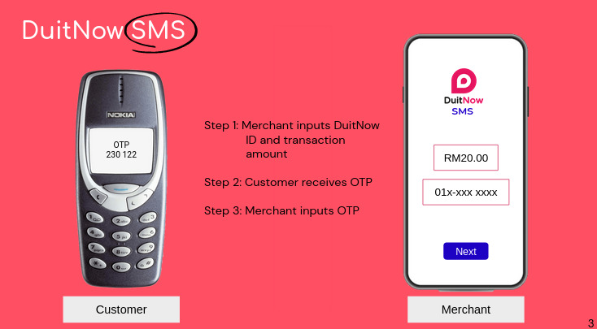

# Duitnow SMS - Payhack 2023 - Team EX-AWS

E-payment without apps: Duitnow SMS

## Description

This is our submission for [PayHack 2023](https://jomhack.com/payhack/) under the financial inclusivity category. We envisioned a payment mechanism where late adopters of e-payment apps can still be included in the e-payments ecosystem by using SMS OTP.

The website is built using the [T3 stack](https://github.com/t3-oss/create-t3-app).

The backend is documented at [asmyio/smspay-backend](https://github.com/asmyio/smspay-backend).

## Team members

Listed in alphabetical order:

+ [github.com/asmyio](https://github.com/asmyio/)
+ [github.com/farhan](https://github.com/farhan-helmy/)
+ [github.com/lawmayy](https://github.com/lawmayy)
+ Rais <3
+ [github.com/tnwei](https://github.com/tnwei/)
